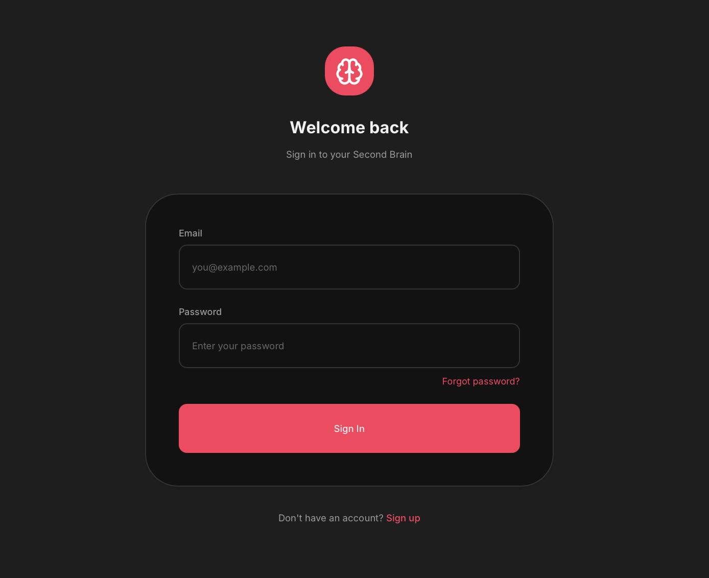
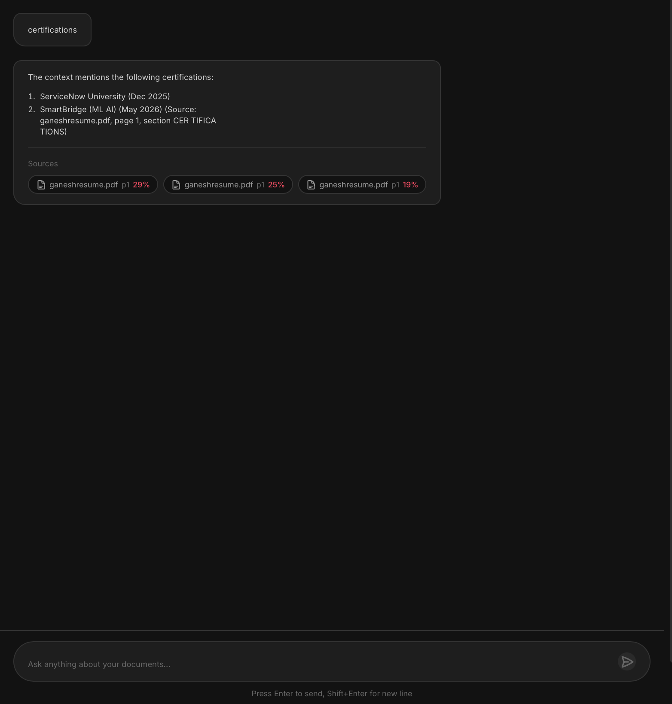
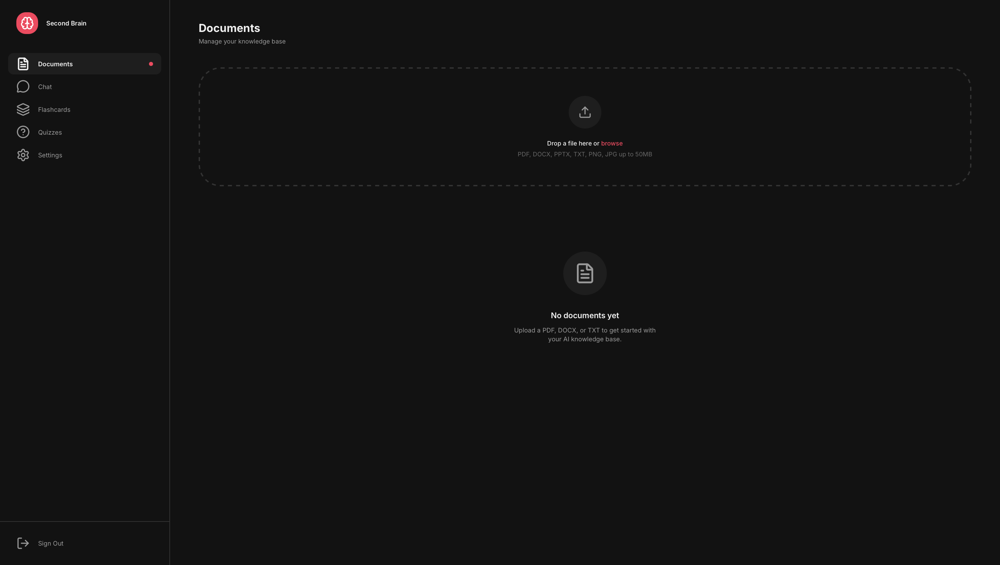
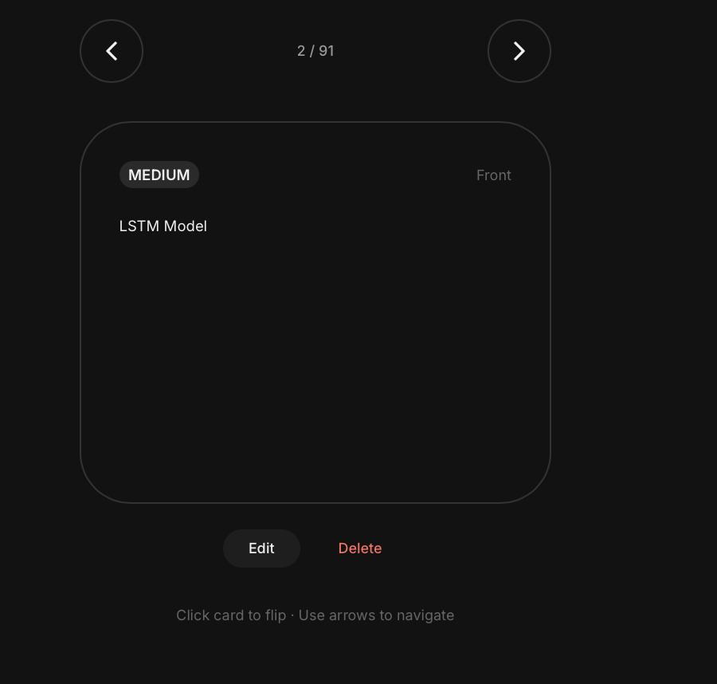
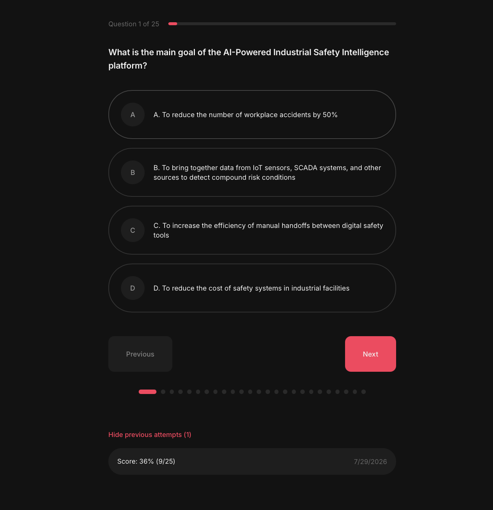
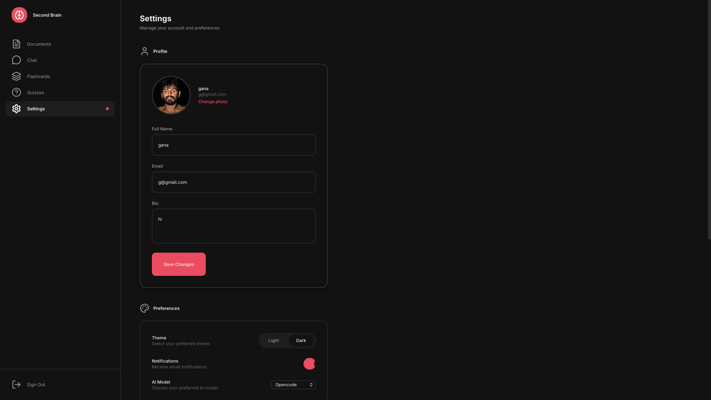

# AI Second Brain

> Your personal AI-powered knowledge base — upload documents, chat with your knowledge, and let it quiz you, generate flashcards, and remember what matters.

[](https://opensource.org/licenses/MIT)
[](https://www.python.org/)
[](https://fastapi.tiangolo.com/)
[](https://nextjs.org/)
[](https://react.dev/)
[](https://www.postgresql.org/)
[](https://redis.io/)
[](https://qdrant.tech/)
[](https://docs.docker.com/compose/)

---

## 📸 Screenshots

| Login Page | Chat Interface |
|:---:|:---:|
|  |  |

| Document Library | Flashcards |
|:---:|:---:|
|  |  |

| Quizzes | Settings |
|:---:|:---:|
|  |  |

<!-- To update: drop PNG files into docs/assets/ named screenshot-0.png … screenshot-5.png -->

---

## 🧠 What It Does

AI Second Brain is a production-grade SaaS that turns your documents into a queryable, learnable knowledge base:

- **📄 Document Upload & Processing** — upload PDFs, DOCX, PPTX, text, and spreadsheets; automatic text extraction, normalization, and chunking
- **💬 RAG Chat** — ask questions in natural language; answers are grounded in your uploaded documents via Retrieval-Augmented Generation
- **🃏 Flashcards** — auto-generated flashcards from your content for spaced-repetition learning
- **📝 Quizzes** — AI-generated quizzes to test your understanding
- **🧩 Memory System** — extracts, ranks, and retains key facts across conversations
- **🔊 Audio Overviews** — podcast-style audio summaries of your content
- **🔐 Full Auth** — registration, email verification, JWT access/refresh tokens, password reset
- **🔎 Semantic Search** — vector search powered by Qdrant + sentence-transformers embeddings

---

## 🛠 Tech Stack

| Layer | Technology | Version |
|-------|-----------|---------|
| Backend API | FastAPI (Python) | 0.138 / 3.11 |
| Frontend | Next.js + React + TypeScript | 14 / 18 / 5 |
| Styling | Tailwind CSS | 3.4 |
| Relational DB | PostgreSQL | 15 |
| Vector DB | Qdrant | latest (qdrant-client 1.18) |
| Cache / Sessions | Redis | 7 |
| ORM & Migrations | SQLAlchemy + Alembic | 2.0 / 1.18 |
| Embeddings | sentence-transformers `all-MiniLM-L6-v2` | 5.6 |
| LLM Provider | OpenRouter — `google/gemini-2.0-flash-lite` (Gemini API also supported) | — |
| Auth | JWT (python-jose) + bcrypt | HS256 |
| Reverse Proxy | Nginx | 1.25 |
| Containerization | Docker + Docker Compose | — |
| Testing | pytest | 8.4 |

---

## 🚀 Local Setup

**Prerequisites:** Docker and Docker Compose installed.

```bash
# 1. Clone the repo
git clone https://github.com/GANA-xg/ai-second-brain.git
cd ai-second-brain

# 2. Configure environment
cp .env.example .env
# Edit .env and set at minimum:
#   POSTGRES_PASSWORD  — any strong password
#   SECRET_KEY         — run: openssl rand -hex 32
#   OPENROUTER_API_KEY — from https://openrouter.ai (or GEMINI_API_KEY)

# 3. Start everything
docker compose up --build

# 4. Open the app
#   Frontend:  http://localhost        (via Nginx)
#   API docs:  http://localhost/api/v1/docs (Swagger UI)
```

To rebuild from scratch: `docker compose down -v && docker compose up --build`

### Running services individually (development)

```bash
# Backend (from ./backend, requires Python 3.11 venv)
pip install -r requirements.txt
uvicorn app.main:app --reload        # http://localhost:8000

# Frontend (from ./frontend, requires Node 20)
npm install
npm run dev                          # http://localhost:3000
```

Database migrations run via Alembic:

```bash
cd backend
alembic upgrade head
```

---

## ✅ Running Tests

```bash
# Full backend suite (from ./backend)
pytest

# Focused coverage (RAG golden tests, smoke tests, file handling)
pytest tests/test_rag_golden.py tests/test_integration_smoke.py tests/test_files.py

# Frontend lint / type check (from ./frontend)
npm run lint
```

---

## 🚢 Deployment

> 🚧 **Deployment is scheduled for Week 21 of the roadmap.** This section will be updated with the production deployment guide once the target platform is finalized.

The stack is already containerized (per-service Dockerfiles + `docker-compose.yml` with Nginx reverse proxy), so deployment will be a matter of pointing `docker compose` at the production host with production secrets.

---

## 🏗 Architecture

- **Architecture diagram:** [diagrams/architecture-v0.png](diagrams/architecture-v0.png)
- **Architecture description:** [docs/architecture-v0.md](docs/architecture-v0.md)

```
┌──────────┐    ┌───────┐    ┌──────────────────┐
│  Browser  │───▶│ Nginx │───▶│  Next.js (3000)  │
└──────────┘    └───┬───┘    └──────────────────┘
                    │
                    │        ┌──────────────────┐     ┌────────────┐
                    └───▶───▶│  FastAPI (8000)  │────▶│ PostgreSQL │
                             └───────┬──────────┘     └────────────┘
                                     │
                       ┌─────────────┼─────────────┐
                       ▼             ▼             ▼
                 ┌──────────┐  ┌──────────┐  ┌──────────┐
                 │  Redis   │  │  Qdrant  │  │ OpenRouter│
                 │  (cache) │  │ (vectors)│  │  (LLM)    │
                 └──────────┘  └──────────┘  └──────────┘
```

**Key docs:** [Database design](docs/database-design.md) · [ERD](docs/erd.md) · [RAG pipeline](docs/embedding-pipeline.md) · [Chat system](docs/chat-system.md) · [Memory system](docs/memory-system.md) · [Quiz system](docs/quiz-system.md) · [Auth flow](docs/auth-flow.md)

---

## 📁 Project Structure

```
ai-second-brain/
├── backend/            # FastAPI application
│   ├── app/
│   │   ├── api/v1/     # REST endpoints (auth, chat, files, quiz, flashcards, memory, voice, health)
│   │   ├── services/   # Business logic (RAG, embeddings, LLM, memory, quizzes)
│   │   ├── models/     # SQLAlchemy models
│   │   ├── schemas/    # Pydantic schemas
│   │   ├── core/       # Config, logging, security
│   │   └── middleware/ # Request ID, logging
│   ├── alembic/        # Database migrations
│   └── tests/          # pytest suite
├── frontend/           # Next.js 14 application (TypeScript + Tailwind)
│   └── src/
│       ├── app/        # App router pages
│       ├── components/ # UI components
│       ├── context/    # React context providers
│       ├── hooks/      # Custom hooks
│       └── lib/        # API client, utilities
├── nginx/              # Reverse proxy config
├── docs/               # Architecture & design documents
├── diagrams/           # Architecture diagrams
├── scripts/            # Utilities (embedding evaluation)
└── docker-compose.yml  # Full stack orchestration
```

---

## 🤝 Contributing & Workflow

- **Branching strategy:** see [docs/branching.md](docs/branching.md) — `main` is protected, work happens on `feature/*` and `fix/*` branches merged via `develop`
- **Bugs:** use the [bug report template](.github/ISSUE_TEMPLATE/bug_report.md)
- **Features:** use the [feature request template](.github/ISSUE_TEMPLATE/feature_request.md)
- **PRs:** follow the [PR template](.github/pull_request_template.md)

Roadmap: [docs/weekly-roadmap.md](docs/weekly-roadmap.md) (22-week plan, tracked via GitHub milestones)

---

## 📄 License

This project is licensed under the [MIT License](LICENSE).
