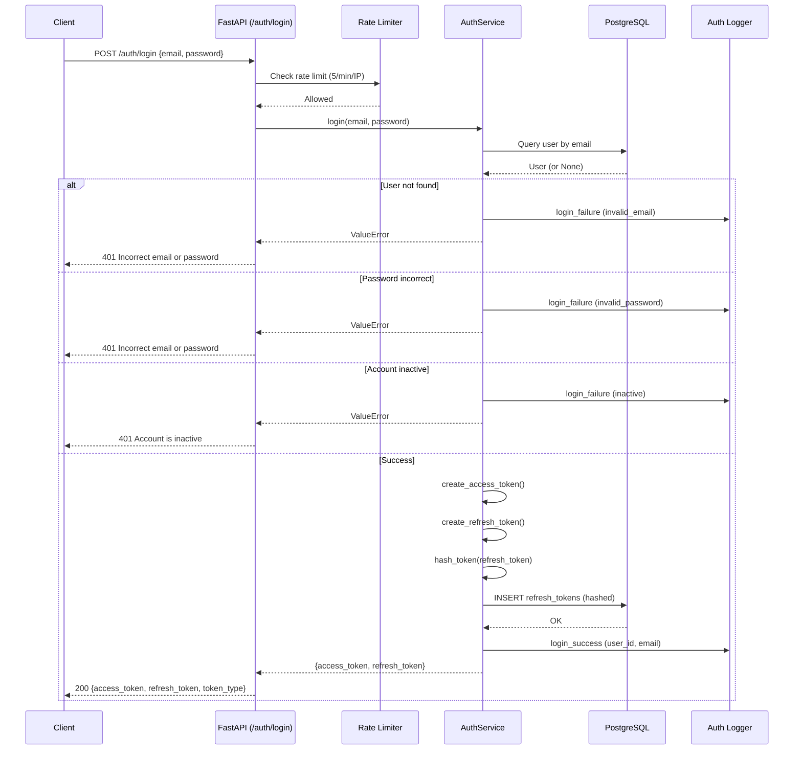
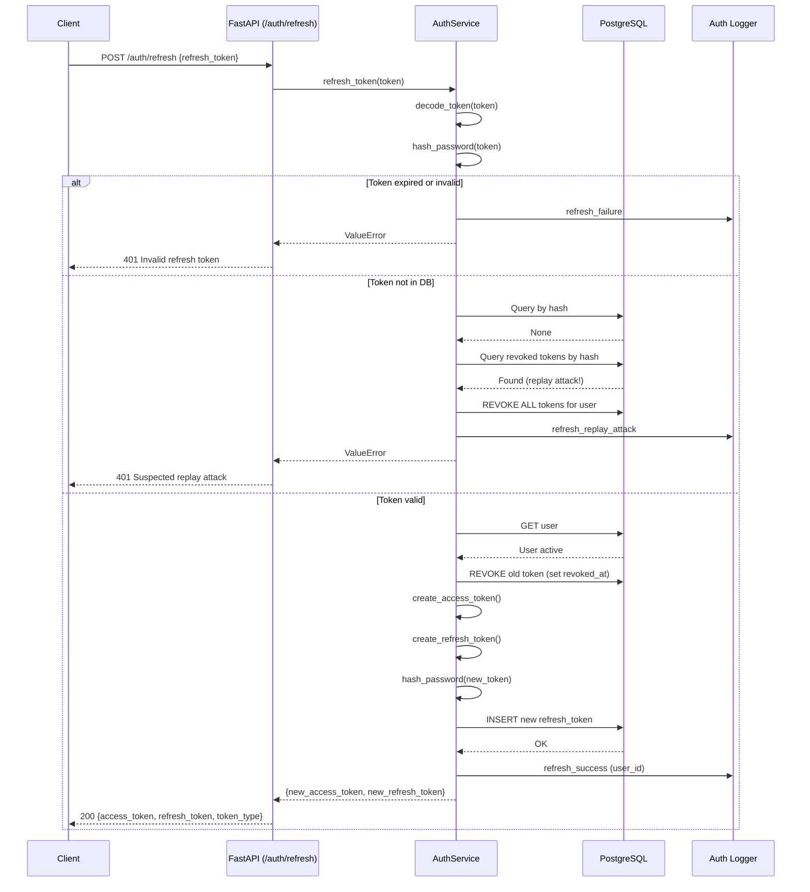
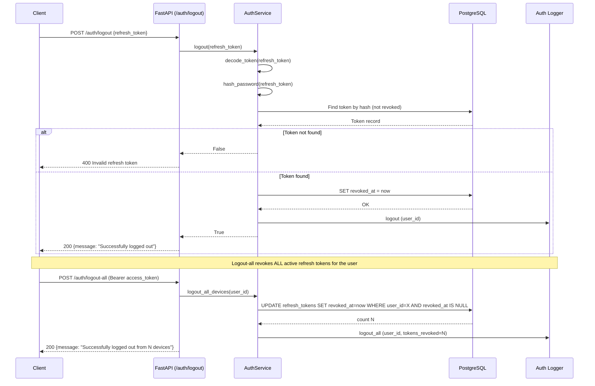
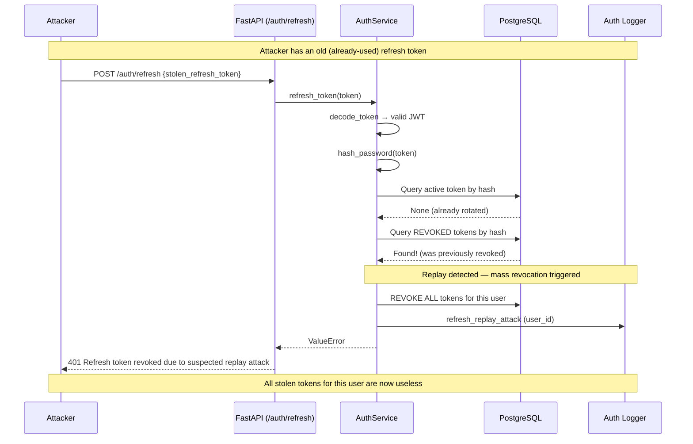

# Authentication Flow — AI Second Brain

## Project Overview

The AI Second Brain uses a **JWT-based authentication system** with:
- Short-lived **access tokens** (15 min default) for API authorization
- Longer-lived **refresh tokens** (30 days default) for obtaining new access tokens
- **Refresh token rotation** — each refresh invalidates the old token and issues a new pair
- **Replay attack detection** — reused refresh tokens trigger full session revocation
- **bcrypt password hashing** (12 rounds)
- **Refresh tokens stored as deterministic SHA-256 hash** for server-side lookup
- **Structured audit logging** for all auth events
- **Rate limiting** on auth endpoints

---

## Authentication Architecture

```
┌──────────────┐         ┌──────────────────┐         ┌──────────────┐
│              │  HTTPS   │                  │  HTTP   │              │
│   Client     │─────────▶│  FastAPI Backend │─────────▶│  PostgreSQL  │
│  (Browser/   │         │                  │         │              │
│   Mobile)    │◀────────│  (Nginx proxy)   │◀────────│              │
│              │  JSON    │                  │  Query   │              │
└──────────────┘         └──────────────────┘         └──────────────┘
                                  │
                                  │                     ┌──────────────┐
                                  ├────────────────────▶│  Auth Logger │
                                  │  (structured JSON)  │  (structlog) │
                                  │                     └──────────────┘
                                  │
                                  ├────────────────────▶│  Rate Limiter│
                                  │  (in-memory /w     │  (sliding     │
                                  │   Redis interface)  │   window)    │
                                  │                     └──────────────┘
```

## Token Structure

### Access Token (JWT)
```json
{
  "sub": "uuid-of-user",
  "type": "access",
  "iat": 1718000000,
  "exp": 1718000900
}
```
- Expires in **15 minutes** (configurable via `ACCESS_TOKEN_EXPIRE_MINUTES`)
- Sent as `Authorization: Bearer <token>` header
- Validated on every protected route

### Refresh Token (JWT)
```json
{
  "sub": "uuid-of-user",
  "type": "refresh",
  "iat": 1718000000,
  "exp": 1720592000
}
```
- Expires in **30 days** (configurable via `REFRESH_TOKEN_EXPIRE_DAYS`)
- Stored as **SHA-256 hash** in `refresh_tokens` table (never plaintext; deterministic for server-side lookup)
- Used **once** — rotated on each use
- Can be revoked server-side

---

## Flow Diagrams

### 1. Login Flow



### 2. Refresh Token Rotation



### 3. Logout Flow



### 4. Replay Attack Detection



---

## Expiration Strategy

| Token | Default TTL | Why this value |
|-------|-------------|----------------|
| Access Token | 15 minutes | Short enough to limit damage if stolen; long enough to avoid excessive refreshes |
| Refresh Token | 30 days | Balances UX (don't log in every session) with security window |

When the access token expires:
1. Client receives `401 Unauthorized` from any protected endpoint
2. Client calls `POST /auth/refresh` with its refresh token
3. Server issues a **new** access token + a **new** refresh token (rotation)
4. The old refresh token is marked as revoked in the database

---

## Security Decisions

| Decision | Rationale |
|----------|-----------|
| **bcrypt (12 rounds)** | Industry standard for password hashing; 12 rounds takes ~250ms, making brute-force impractical |
| **Refresh tokens stored as bcrypt hashes** | Even if the database is leaked, refresh tokens cannot be recovered |
| **Refresh token rotation** | Each refresh invalidates the old token; a stolen refresh token can only be used once |
| **Replay attack → full revocation** | If a rotated token is reused, all user sessions are invalidated — assumes the token was compromised |
| **Access tokens are NOT stored in DB** | Stateless JWT validation avoids DB lookups on every request |
| **X-Forwarded-For respected** | Works behind Nginx or other reverse proxies |
| **Rate limiting on auth endpoints** | Mitigates brute-force and credential stuffing attacks |
| **Structured audit logging** | All auth events logged with request_id for traceability in production incidents |

---

## Failure Scenarios

| Scenario | HTTP Status | Response |
|----------|-------------|----------|
| Invalid email format | 422 | Validation error from Pydantic |
| Email already registered | 400 | "Email already registered" |
| Wrong email or password | 401 | "Incorrect email or password" (identical message for both) |
| Account inactive | 401 | "Account is inactive" |
| Expired access token | 401 | "Could not validate credentials" |
| Expired refresh token | 401 | "Invalid refresh token" |
| Replay attack | 401 | "Refresh token revoked due to suspected replay attack" |
| Rate limit exceeded | 429 | "Too many requests. Please try again later." + Retry-After header |
| No auth header | 401 | "Could not validate credentials" |
| Logout with invalid token | 400 | "Invalid refresh token" |
| Logout-all by inactive user | 400 | "Inactive user" |

---

## Environment Variables

| Variable | Default | Description |
|----------|---------|-------------|
| `SECRET_KEY` | (required) | HMAC secret for JWT signing |
| `ALGORITHM` | `HS256` | JWT signing algorithm |
| `ACCESS_TOKEN_EXPIRE_MINUTES` | `15` | Access token TTL |
| `REFRESH_TOKEN_EXPIRE_DAYS` | `30` | Refresh token TTL |
| `BCRYPT_ROUNDS` | `12` | bcrypt cost factor |
| `LOGIN_RATE_LIMIT` | `5` | Max login attempts per IP per window |
| `LOGIN_RATE_LIMIT_WINDOW_SECONDS` | `60` | Login rate limit window |
| `REGISTER_RATE_LIMIT` | `3` | Max registrations per IP per window |
| `REGISTER_RATE_LIMIT_WINDOW_SECONDS` | `60` | Register rate limit window |
| `REFRESH_RATE_LIMIT` | `20` | Max refresh attempts per user per window |
| `REFRESH_RATE_LIMIT_WINDOW_SECONDS` | `60` | Refresh rate limit window |
| `LOGOUT_RATE_LIMIT` | `30` | Max logout attempts per user per window |
| `LOGOUT_RATE_LIMIT_WINDOW_SECONDS` | `60` | Logout rate limit window |
| `AUTH_LOG_LEVEL` | `INFO` | Log level for auth events (DEBUG, INFO, WARNING, ERROR) |

---

## Best Practices

1. **Use HTTPS in production** — tokens are transmitted in headers
2. **Store tokens securely on the client** — httpOnly cookies preferred over localStorage for web apps
3. **Implement silent refresh** — intercept 401s, refresh in background, retry the original request
4. **Monitor auth logs** — watch for replay attacks indicating token theft
5. **Set reasonable rate limits** — tune based on your user base
6. **Rotate SECRET_KEY periodically** — invalidate all existing tokens gracefully
7. **Never log tokens or passwords** — the auth logger explicitly blocks these fields

---

## Future Extensions

- **Email verification flow** — register → send verification email → activate account
- **Password reset flow** — forgot password → email link → reset
- **OAuth2 / SSO integration** — Google, GitHub login
- **MFA / TOTP** — second factor for sensitive operations
- **Redis-backed rate limiting** — swap `InMemoryRateStore` for a Redis implementation
- **Session management UI** — view and revoke active sessions from user settings
- **Account lockout** — temporary lock after N failed login attempts
- **JWT blacklist** — immediate token invalidation via Redis for critical scenarios
