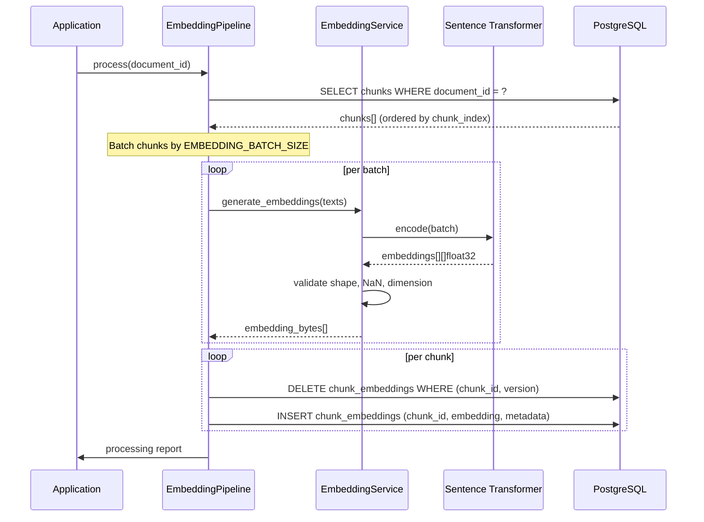

# Embedding Pipeline (Part 6)

## Overview

The embedding pipeline generates deterministic vector embeddings for every text chunk produced by the document processing pipeline (Part 5). Embeddings are stored in PostgreSQL as serialised float32 vectors alongside full version metadata, enabling idempotent re-embedding when models are upgraded.

### Architecture

```
Chunk (from DB)
    │
    ▼
Batch Selection (ordered by chunk_index)
    │
    ▼
Sentence Transformer (configurable batch size)
    │
    ▼
Embedding Validation (shape, NaN, dimension)
    │
    ▼
Metadata Recording (model, version, dimension)
    │
    ▼
Persistence (idempotent: delete-then-insert per version)
    │
    ▼
Processing Report (structured log — no content)
```

### Sequence



## Model Selection

| Attribute | Value |
|-----------|-------|
| **Default model** | `sentence-transformers/all-MiniLM-L6-v2` |
| **Embedding dimension** | 384 |
| **Normalisation** | L2-normalised (unit vectors) |
| **Design** | Deterministic: same text → same bytes |

The model is loaded once (lazy singleton in `embedding_service.py`) and reused across all calls. Model loading happens on the first call to `generate_embeddings()` or `get_embedding_dimension()`.

### Future Model Upgrades

- Change `EMBEDDING_MODEL` and `EMBEDDING_VERSION` in config.
- Re-run the pipeline: new embeddings sit alongside old ones with different `embedding_version`.
- Search can filter by version or query the latest.

## Batch Processing

Batches are processed in sequence (not parallel) to ensure deterministic ordering. Configuration:

| Variable | Default | Description |
|----------|---------|-------------|
| `EMBEDDING_BATCH_SIZE` | 32 | Texts per batch |
| `EMBEDDING_TIMEOUT_SECONDS` | 30 | Wall-clock timeout per batch |
| `EMBEDDING_MAX_RETRIES` | 3 | Max retries for a failed batch |

### Retry Behaviour

- If a batch fails (timeout, model error, validation error): retry up to `EMBEDDING_MAX_RETRIES` times.
- If all retries fail: the batch indices are recorded as `failed_indices` and processing continues with remaining batches.
- Failed chunks produce empty embeddings (`b""`); they do not block the pipeline.
- The pipeline report distinguishes `embedded_chunks` from `failed_chunks`.

## Versioning

Embedding versioning prevents accidental overwrites when models change.

| Variable | Default | Purpose |
|----------|---------|---------|
| `EMBEDDING_VERSION` | `v1` | Tags every embedding with the generation version |

- Multiple embedding versions can coexist for the same chunk.
- The `UNIQUE (chunk_id, embedding_version)` constraint prevents duplicates within a version.
- Re-running the pipeline with the same version replaces (delete-then-insert) old embeddings.
- Running with a different version adds new embeddings alongside existing ones.

### Upgrade Workflow

1. Set `EMBEDDING_MODEL` to the new model name.
2. Bump `EMBEDDING_VERSION` (e.g. `v2`).
3. Re-run embedding generation.
4. Old embeddings remain queryable for backwards compatibility.
5. Switch query logic to prefer the latest version.

## Metadata Schema

Table: `chunk_embeddings`

| Column | Type | Description |
|--------|------|-------------|
| `id` | UUID (PK) | Primary key |
| `chunk_id` | UUID (FK → chunks.id, CASCADE) | Owning chunk |
| `embedding` | LargeBinary | Serialized float32 vector (dim × 4 bytes) |
| `embedding_model` | String(255) | Full HF model name, e.g. `sentence-transformers/all-MiniLM-L6-v2` |
| `embedding_version` | String(50) | Version tag, e.g. `v1` |
| `embedding_dimension` | Integer | Vector dimension (384 for all-MiniLM-L6-v2) |
| `magnitude` | Float (nullable) | L2 magnitude (≈1.0 for normalised embeddings) |
| `created_at` | Timestamp | When the embedding was generated |
| `updated_at` | Timestamp | Last update timestamp |
| `deleted_at` | Timestamp (nullable) | Soft delete timestamp |

**Unique constraint:** `(chunk_id, embedding_version)` — prevents duplicate embeddings and enables idempotent re-runs.

### Metadata Guarantees

- Every stored embedding carries `embedding_model` and `embedding_version`.
- `embedding_dimension` matches the model's output dimension.
- `chunk_id` references the exact chunk that produced the text.
- `magnitude ≈ 1.0` for normalised embeddings.

## Idempotent Processing

The pipeline guarantees idempotency:

1. Before inserting new embeddings, it deletes any existing `ChunkEmbedding` records matching the same `(chunk_id, embedding_version)`.
2. A `UNIQUE (chunk_id, embedding_version)` constraint provides a last-line defence against duplicates.
3. Re-running the pipeline with the same version produces the same set of embeddings (delete → insert).
4. Re-running with a different version adds new embeddings; old ones remain untouched.

## Failure Handling

| Scenario | Behaviour |
|----------|-----------|
| Empty chunk list | Logs `embedding.no_chunks`, returns immediately |
| Batch timeout after retries | Records as `failed_indices`, continues remaining batches |
| Missing model | Raises `ImportError` with installation instructions |
| Invalid embedding (NaN, wrong shape) | Triggers retry; if persistent, records as `failed` |
| Database error during persistence | Propagates exception; caller handles rollback |
| Complete failure (all batches fail) | Logs `embedding.pipeline_failed` with error details |

## Configuration

All variables are read from environment. The `Settings` class provides defaults.

| Environment Variable | Default | Type | Description |
|---------------------|---------|------|-------------|
| `EMBEDDING_MODEL` | `sentence-transformers/all-MiniLM-L6-v2` | str | HuggingFace model name |
| `EMBEDDING_VERSION` | `v1` | str | Version tag for embedding records |
| `EMBEDDING_BATCH_SIZE` | `32` | int | Texts processed per batch |
| `EMBEDDING_TIMEOUT_SECONDS` | `30` | int | Per-batch wall-clock timeout |
| `EMBEDDING_MAX_RETRIES` | `3` | int | Retries for failed batches |

## Logging

Structured `structlog` events are emitted:

| Event | Level | When |
|-------|-------|------|
| `embedding.model_loading` | INFO | Model download started |
| `embedding.model_loaded` | INFO | Model loaded (includes dimension + device) |
| `embedding.batch_start` | INFO | Batch processing begins |
| `embedding.batch_done` | INFO | Batch processing complete |
| `embedding.batch_retry` | WARNING | Batch failed, retrying |
| `embedding.batch_failed` | ERROR | Batch failed after all retries |
| `embedding.document_embedded` | INFO | All chunks embedded successfully |
| `embedding.document_partially_embedded` | WARNING | Some chunks failed |
| `embedding.document_embedding_failed` | ERROR | Pipeline failed entirely |
| `embedding.no_chunks` | INFO | Document has no chunks to embed |
| `embedding.pipeline_failed` | ERROR | Unexpected pipeline error |

**Security:** No chunk content is ever logged. Only document IDs, filenames, chunk counts, and timing metadata.

## Re-Embedding Policy

### When to Re-Embed

- Upgrading to a newer/better embedding model.
- Changing model configuration (e.g. different pooling strategy).
- After chunk regeneration (changing chunk size/overlap).

### Model Upgrade Workflow

1. **Choose new model** — select and validate on the evaluation dataset.
2. **Set configuration** — update `EMBEDDING_MODEL` and bump `EMBEDDING_VERSION`.
3. **Re-embed** — run the pipeline for all documents that need new embeddings.
4. **Verify** — run `scripts/evaluate_embeddings.py` to compare quality.
5. **Migrate queries** — update search logic to use the new version.

### Version Coexistence

- Multiple embedding versions live in the same `chunk_embeddings` table.
- Queries filter by `embedding_version` to select the desired generation.
- Old versions can be pruned once all dependent systems have migrated.

### Rollback Strategy

- To roll back a model upgrade: restore the previous `EMBEDDING_MODEL` and `EMBEDDING_VERSION` in config. Old embeddings were never deleted, so queries immediately revert.
- To fully clean up a failed model trial: delete all `chunk_embeddings` with that `embedding_version`.

### Cleanup Policy

Old embedding versions should be retained for at least one release cycle after a new version is deployed, then pruned via a scheduled script:

```sql
DELETE FROM chunk_embeddings
WHERE embedding_version = '<old_version>'
  AND created_at < NOW() - INTERVAL '30 days';
```

## Developer Workflow

```bash
# Install
pip install sentence-transformers numpy scikit-learn

# Run tests (model-dependent tests skip if model unavailable)
pytest tests/test_embedding.py -v

# Evaluate embedding quality
python scripts/evaluate_embeddings.py

# Generate embeddings for all chunks of a document
python -c "
from app.core.config import settings
from app.services.embedding_pipeline import EmbeddingPipeline
pipeline = EmbeddingPipeline(settings)
pipeline.process(db, document)
"
```

## Evaluation

Run `scripts/evaluate_embeddings.py` to measure:

- Cosine similarity of semantically related vs. unrelated text pairs
- Nearest-neighbour sanity for known queries
- Identical-text duplicate detection

Expected results for `all-MiniLM-L6-v2`:

- Related text similarity: > 0.5
- Unrelated text similarity: < 0.2
- Identical text similarity: ≈ 1.0 (within 1e-5)
- Separation margin: > 0.4

## Security

| Control | Implementation |
|---------|---------------|
| No cross-user mixing | Embeddings scoped to chunks, which are scoped to documents, which are scoped to users. Pipeline accepts a `document_id` only. |
| Deterministic | Same model + input → same bytes. No randomness in generation. |
| Version tracking | Every embedding stores `embedding_model` and `embedding_version`. |
| Safe retry | Delete-then-insert + unique constraint prevent duplicates on retry. |
| Log sanitisation | No chunk content logged. Only IDs, stats, and metadata. |
| Failures | Failed batches do not block remaining batches. Report distinguishes successes from failures. |
