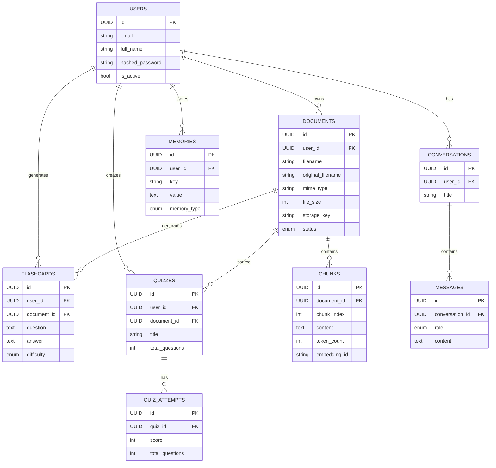

# AI Second Brain - Entity Relationship Diagram

```mermaid
erDiagram

    USERS ||--o{ DOCUMENTS : owns
    USERS ||--o{ CONVERSATIONS : has
    USERS ||--o{ FLASHCARDS : generates
    USERS ||--o{ QUIZZES : creates
    USERS ||--o{ MEMORIES : stores

    DOCUMENTS ||--o{ CHUNKS : contains
    DOCUMENTS ||--o{ FLASHCARDS : generates
    DOCUMENTS ||--o{ QUIZZES : source

    CONVERSATIONS ||--o{ MESSAGES : contains

    QUIZZES ||--o{ QUIZ_ATTEMPTS : has


    USERS {
        UUID id PK
        string email
        string full_name
        string hashed_password
        bool is_active
    }

    DOCUMENTS {
        UUID id PK
        UUID user_id FK
        string filename
        string original_filename
        string mime_type
        int file_size
        string storage_key
        enum status
    }

    CHUNKS {
        UUID id PK
        UUID document_id FK
        int chunk_index
        text content
        int token_count
        string embedding_id
    }

    CONVERSATIONS {
        UUID id PK
        UUID user_id FK
        string title
    }

    MESSAGES {
        UUID id PK
        UUID conversation_id FK
        enum role
        text content
    }

    FLASHCARDS {
        UUID id PK
        UUID user_id FK
        UUID document_id FK
        text question
        text answer
        enum difficulty
    }

    QUIZZES {
        UUID id PK
        UUID user_id FK
        UUID document_id FK
        string title
        int total_questions
    }

    QUIZ_ATTEMPTS {
        UUID id PK
        UUID quiz_id FK
        int score
        int total_questions
    }

    MEMORIES {
        UUID id PK
        UUID user_id FK
        string key
        text value
        enum memory_type
    }
```