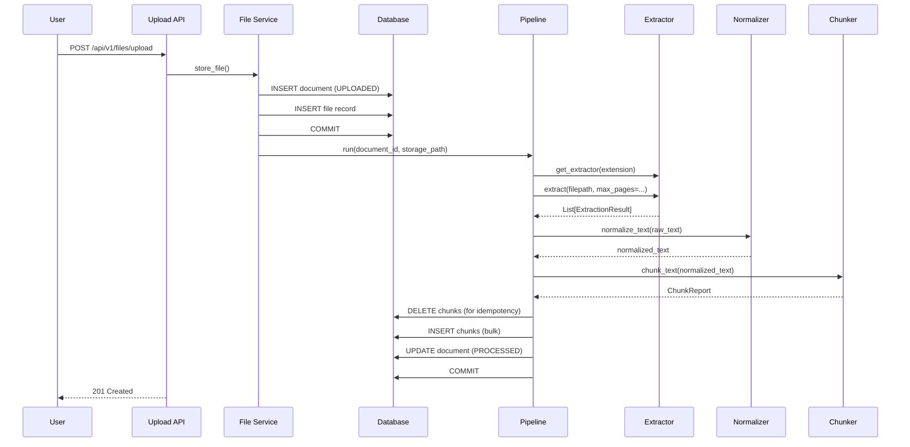

# Document Processing Pipeline

## Overview

The document processing pipeline transforms uploaded files into searchable,
deterministically-chunked text embeddings. It runs **synchronously** after a
successful upload commit, providing transactional integrity: if the pipeline
fails, the document is marked `FAILED` and no orphan chunks remain.

### Status Flow

```
UPLOADED → PROCESSING → PROCESSED   (success)
                  ↘ FAILED          (any failure)
```

The upload completes with status `UPLOADED` atomically. The pipeline then
transitions the document through `PROCESSING` to `PROCESSED` (or `FAILED`).

---

## Architecture

```
┌──────────┐     ┌────────────────┐     ┌──────────────┐
│  Upload  │ ──► │  file_service  │ ──► │     DB       │
│  endpoint│     │  .store_file() │     │  (INSERT)    │
└──────────┘     └───────┬────────┘     └──────┬───────┘
                         │                     │
                         │                     │
                         ▼                     │
                ┌────────────────┐             │
                │  Document      │             │
                │  Pipeline.run()│ ◄───────────┘
                │                │  (after commit)
                └─┬──┬──┬──┬────┘
                  │  │  │  │
                  ▼  ▼  ▼  ▼
           ┌────────┐ ┌───┐ ┌────────┐ ┌──────┐
           │Extract │►│Norm│►│ Chunk  │►│Store │
           └────────┘ └───┘ └────────┘ └──────┘
```

### Services

| Service | Responsibility |
|---------|---------------|
| `text_extractor.py` | Reads files, returns `List[ExtractionResult]` with page/slide/section info |
| `text_normalizer.py` | NFC Unicode, whitespace collapse, line-ending conversion |
| `text_chunker.py` | Character-window splitting with configurable overlap |
| `processing_pipeline.py` | Orchestrator: extract → normalize → chunk → persist |

### Extraction Pipeline

Each extractor receives the **file path** and optional configuration via
`**kwargs`. The pipeline passes `max_pages=settings.PDF_MAX_PAGES` uniformly
to all extractors; non-PDF extractors ignore it via `**kwargs: object`.

```
               ┌─────────┐
               │  .pdf   │ ──► extract_pdf(filepath, max_pages=100)
               ├─────────┤
               │  .docx  │ ──► extract_docx(filepath, **kwargs)
               ├─────────┤
               │  .pptx  │ ──► extract_pptx(filepath, **kwargs)
               ├─────────┤
               │  .txt   │ ──► extract_txt(filepath, **kwargs)
               ├─────────┤
               │ .png/.  │ ──► extract_image(filepath, **kwargs)
               │ .jpg    │     (raises ValueError – OCR not implemented)
               ├─────────┤
               │ other   │ ──► rejected at upload validation (400)
               └─────────┘
```

#### ExtractionResult

```python
@dataclass
class ExtractionResult:
    text: str             # Extracted text from one page/slide/paragraph
    page_number: int | None    # PDF page number (1-indexed)
    slide_number: int | None   # PPTX slide number (1-indexed)
    section: str | None        # DOCX heading section name
```

---

### Normalization

The normalizer (`text_normalizer.py`) applies these transforms **deterministically**:

1. **Unicode NFC** — All text is normalized to NFC (composed) form.
2. **Line ending conversion** — `\r\n` and `\r` converted to `\n`.
3. **Whitespace collapse** — `preserve_boundaries=False`: all whitespace runs
   (spaces, tabs, newlines) collapsed to single space, then trimmed.
   `preserve_boundaries=True`: blank lines preserved between paragraphs.
4. **Strip** — Leading and trailing whitespace removed.

The same input **always** produces the same output.

---

### Chunking Algorithm

The chunker (`text_chunker.py`) implements a **character-window** strategy:

#### Parameters (from config)

| Variable | Default | Description |
|----------|---------|-------------|
| `CHUNK_SIZE` | 1000 | Max characters per chunk |
| `CHUNK_OVERLAP` | 200 | Character overlap between consecutive chunks |
| `CHUNK_MIN_SIZE` | 200 | Minimum characters for a standalone trailing chunk |

#### Algorithm

```
1. If text length ≤ CHUNK_SIZE → single chunk
2. Walk through text in steps of (CHUNK_SIZE - CHUNK_OVERLAP)
3. For each window:
   a. Take characters [step*i : step*i + CHUNK_SIZE]
   b. Adjust end boundary to nearest paragraph break (\n\n) when possible
      for cleaner semantic boundaries
4. For the final segment:
   a. If remaining text > CHUNK_MIN_SIZE → standalone final chunk
   b. If remaining text ≤ CHUNK_MIN_SIZE → merge into previous chunk
      (avoids tiny, content-poor final chunks)
```

#### Overlap Strategy

- Each chunk overlaps the previous by up to `CHUNK_OVERLAP` characters.
- The exact overlap is `CHUNK_SIZE - chunk_index * step` for the start of
  chunk N, where `step = CHUNK_SIZE - CHUNK_OVERLAP`.
- Overlap ensures context continuity between chunks for RAG retrieval.

#### Determinism

The chunker is a **pure function** — calling `chunk_text(text, chunk_size,
overlap)` with the same arguments always returns identical chunk output,
including identical character offsets and content.

---

### Metadata Schema

Each stored `Chunk` record carries:

| Column | Type | Description |
|--------|------|-------------|
| `id` | UUID | Primary key |
| `document_id` | UUID (FK → document) | Parent document |
| `chunk_index` | Int | Sequential index (0-based) |
| `content` | Text | The chunk text |
| `page_number` | Int? | Source page (PDF) |
| `slide_number` | Int? | Source slide (PPTX) |
| `section` | String? | Source section (DOCX) |
| `character_start` | Int | Offset in original text |
| `character_end` | Int | End offset |
| `token_estimate` | Int | `ceil(len(content) / 4)` |
| `source_type` | String | `pdf`, `docx`, `pptx`, `txt` |
| `created_at` | DateTime | Insert time |

---

### Idempotent Processing

Processing the same document **twice** (e.g., via a future reprocess endpoint):

1. Pipeline **deletes** all existing chunks for `document_id` at the start of
   `run()`.
2. Pipeline extracts, normalizes, and chunks from the stored file.
3. New chunks are inserted atomically.
4. Result: semantically identical chunks (since extraction and chunking are
   deterministic) but with new database IDs.

There is no risk of duplicate rows — old chunks are cleaned up first.

---

### Failure Handling

| Failure Mode | Behaviour |
|-------------|-----------|
| Unknown extension | Rejected at upload validation (400) before pipeline |
| Corrupted file | Pipeline catches exception, sets status `FAILED`, populates `error_message` |
| Empty file | Pipeline produces 0 chunks, sets `PROCESSED` with warning |
| Image upload (no OCR) | `extract_image` raises `ValueError`, pipeline sets `FAILED` |
| Extraction error | `_fail()` rollback deletes any partial chunks, sets `FAILED` |
| DB error | SQLAlchemy rollback, no partial state persists |

In every failure case:
- Document status is set to `FAILED` with descriptive `error_message`.
- Any chunks written during the failed attempt are rolled back (same session).
- The original uploaded file is preserved.

---

### Configuration Variables

Defined in `backend/app/core/config.py` under the `Settings` class:

```python
# Processing / Chunking
PDF_MAX_PAGES: int = 100          # Max PDF pages to extract
CHUNK_SIZE: int = 1000            # Characters per chunk
CHUNK_OVERLAP: int = 200          # Overlap between consecutive chunks
CHUNK_MIN_SIZE: int = 200         # Min chars for standalone trailing chunk
```

These can be overridden via environment variables:
```
PDF_MAX_PAGES=200 CHUNK_SIZE=500 uvicorn app.main:app
```

---

### Sequence Diagram



---

### Future OCR Extension Point

Image processing is reserved for future implementation. When OCR is added:

1. **Install** an OCR library (e.g., `pytesseract`, `doctr`, or `easyocr`).
2. **Update** `extract_image()` in `text_extractor.py` to call the OCR engine
   and return `List[ExtractionResult]` with extracted text.
3. The **pipeline** automatically picks up the change — no orchestration
   changes needed.

The `extract_image` function currently raises `ValueError` with a clear
message:
```
OCR text extraction is not yet implemented for image files.
Image uploads are accepted but cannot be processed for text content
in this phase.
```

---

### Security Considerations

- **Document contents are never logged** — only filenames, sizes, hashes,
  and document IDs appear in structured logs.
- **Rollback guarantees** — The pipeline runs in a single DB transaction.
  Any failure triggers a full rollback, leaving no orphan chunks.
- **Idempotent reprocessing** — Existing chunks are deleted before writing
  new ones, preventing duplicate accumulation.
- **Source tracking** — Every chunk records its `source_type` (derived from
  the original file extension), preventing metadata confusion.
- **Deterministic output** — Same file always produces identical chunks,
  making caching and deduplication safe.
- **Status isolation** — `FAILED` documents retain their uploaded file but
  produce no chunks, preserving the original data for downstream debugging.

---

### Testing

See `tests/test_processing.py` (42 tests) covering:

- Extraction for all supported formats
- Image failure handling
- Normalization (Unicode, whitespace, line endings)
- Chunking (ordering, count, overlap, determinism, metadata)
- Pipeline integration via upload API
- Metadata persistence on stored chunks
- Idempotent reprocessing
- Transaction safety (no orphan chunks on failure)
- Structured processing logs
- Content confidentiality (no secrets in logs)
